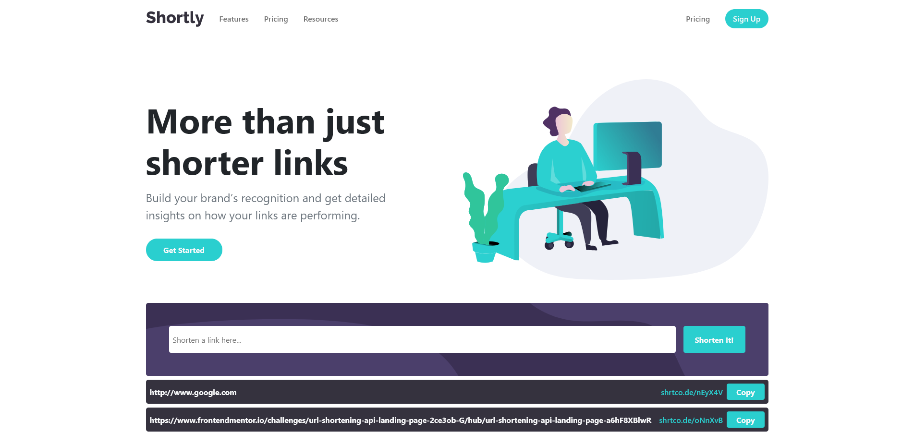
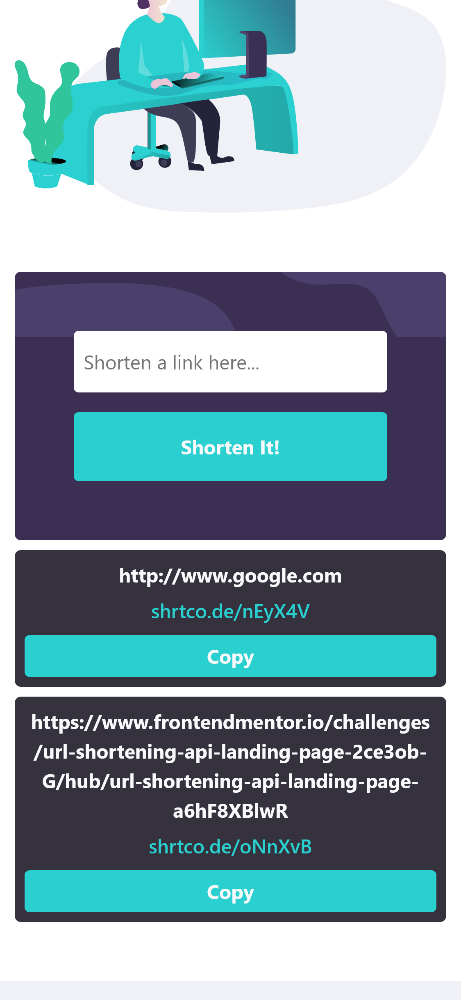

# Responsive URL Shortener

Live website: https://fatihbulbul1.github.io/react-responsive-url-shortener
# Overview
Made by:
- **React**
- **Bootstrap**
- Plain CSS
- Responsive design

### Font
- I used default Bootstrap font.  
## Description 
- This website created for Frontend Mentor challenge. [Check challenge](https://www.frontendmentor.io/challenges/url-shortening-api-landing-page-2ce3ob-G/hub/url-shortening-api-landing-page-a6hF8XBlwR)
- Fully responsive design.
- Click-to-copy.

### Author
- LinkedIn - [Ömer Fatih Bülbül](https://www.linkedin.com/in/ömer-fatih-bülbül-74a890236/)
- Twitter - [fatihbulbul91](https://twitter.com/fatihbulbul91)
- Frontend Mentor - [fatihbulbul1](https://www.frontendmentor.io/profile/fatihbulbul1)